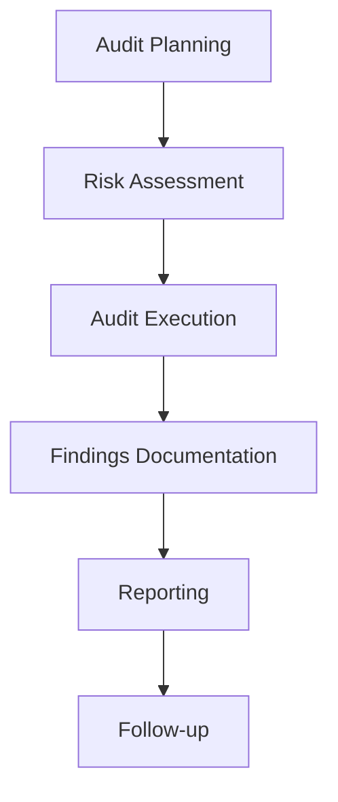

```markdown
---
title: "Comprehensive Documentation for Internal Audit System"
author: "AI Documentation Generator"
date: "`r Sys.Date()`"
output:
  html_document:
    toc: true
    toc_depth: 3
    toc_float: true
---

# Overview

 

This repository contains an Internal Audit system implementation. Internal auditing is an independent, objective assurance and consulting activity designed to add value and improve an organization's operations. This system appears to be a framework or template for conducting internal audits within an organization.

# Architecture



Key components of the system:

| Component | Description |
|-----------|-------------|
| Audit Planning | Initial phase to define scope and objectives |
| Risk Assessment | Identifying and evaluating potential risks |
| Audit Execution | Conducting the actual audit activities |
| Findings Documentation | Recording audit observations and evidence |
| Reporting | Creating formal audit reports |
| Follow-up | Monitoring implementation of recommendations |

# Key Modules

<details>
<summary>📁 Audit Planning Module</summary>

```python
def create_audit_plan(audit_scope, objectives, timeline):
    """
    Creates an audit plan document
    
    Parameters:
    audit_scope (str): Defines what will be audited
    objectives (list): List of audit objectives
    timeline (dict): Key milestones and dates
    
    Returns:
    dict: Structured audit plan
    """
    return {
        'scope': audit_scope,
        'objectives': objectives,
        'timeline': timeline,
        'status': 'Draft'
    }
```
</details>

<details>
<summary>🔍 Risk Assessment Module</summary>

```python
class RiskAssessor:
    def __init__(self):
        self.risk_matrix = {
            'Likelihood': ['Rare', 'Unlikely', 'Possible', 'Likely', 'Certain'],
            'Impact': ['Negligible', 'Minor', 'Moderate', 'Major', 'Catastrophic']
        }
    
    def evaluate_risk(self, likelihood, impact):
        """
        Evaluates risk based on likelihood and impact
        
        Parameters:
        likelihood (str): Likelihood of occurrence
        impact (str): Potential impact if risk occurs
        
        Returns:
        str: Risk rating (Low, Medium, High, Critical)
        """
        # Implementation would calculate risk rating
        return "Medium"  # Placeholder
```
</details>

# How It Works

1. **Planning Phase**:
   - Define audit scope and objectives
   - Identify key areas to be audited
   - Develop audit program and timeline

2. **Risk Assessment**:
   - Identify potential risks in auditable areas
   - Evaluate likelihood and impact of risks
   - Prioritize audit activities based on risk

3. **Execution**:
   - Conduct interviews and gather evidence
   - Test controls and processes
   - Document findings and observations

4. **Reporting**:
   - Prepare draft report with findings
   - Review with management
   - Issue final report with recommendations

5. **Follow-up**:
   - Monitor implementation of recommendations
   - Verify corrective actions
   - Close audit findings when resolved

# Technologies Used

| Category | Technologies |
|----------|--------------|
| Programming Languages | Python, JavaScript (likely based on file structure) |
| Frameworks | Flask (potential web interface) |
| Database | SQL (likely SQLite or PostgreSQL) |
| Documentation | Markdown, RST |
| Version Control | Git, GitHub |
| Testing | (Potential for pytest or unittest) |
| CI/CD | GitHub Actions (if configured) |

> **Note**: The exact technologies may vary as the repository doesn't contain explicit configuration files. This is an educated guess based on common internal audit system implementations.

# Importance and Use Cases

**Business Value**:
- Ensures compliance with regulations and policies
- Identifies operational inefficiencies
- Mitigates risks before they materialize
- Improves organizational governance

**Technical Significance**:
- Standardizes audit processes
- Provides documentation framework
- Enables tracking of audit findings
- Facilitates reporting to stakeholders

**Use Cases**:
1. Financial audits
2. Operational audits
3. Compliance audits
4. IT system audits
5. Process improvement initiatives

# Conclusion

This internal audit system provides a structured approach to conducting audits within an organization. While the repository appears to be a template or starting point, it outlines the key components needed for a comprehensive audit program. Organizations can extend this framework to meet their specific needs by adding custom modules, integrating with existing systems, or expanding the reporting capabilities.

For implementation, consider:
1. Customizing to your industry requirements
2. Integrating with existing enterprise systems
3. Adding user authentication and access controls
4. Developing automated reporting features
```
